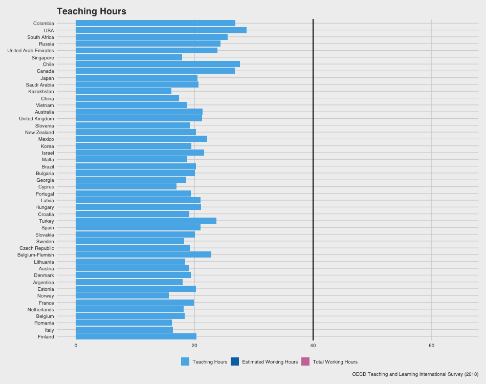
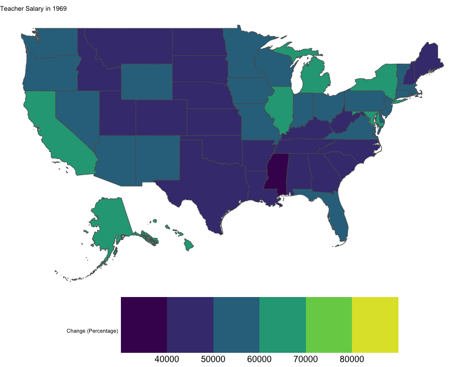

```{r setup, include=FALSE}
library(flexdashboard)
library(tidyverse)
library(psych)
library(knitr)
library(rio)
library(cowplot)
library(colorblindr)
library(gganimate)
library(RColorBrewer)
library(maps)
library(sp)
here::here()
data <- import(here::here("data.RData"))
```
Zach, this is beautiful! You started out with such a large data set and many variables, but efficiently organized it and created the variables of interest. I appreciate the headings and steps you listed throughout the rmd file as well. I really haven't looked much into how to create gifs in R or ever tried to do it on my own, so seeing how you executed that in so many different types of plots is really helpful. Hopefully I'll try it out soon. 
```{r import, cache=TRUE, include = FALSE, eval = FALSE}
data_full <- import(here::here("data_ignore", "TTGINTT3.sav"), setclass = "tbl_df")

# Data frame selecting variables of interest
data <- tibble(data_full[,c(6,9, 12, 44, 48:51, 54, 79:90, 232:242, 299:329)])

# Creating total_time variable of total reported hours worked/week
data <- data %>% 
  rowwise() %>% 
  mutate(
    total_time <- (TT3G17 +TT3G18A +TT3G18B+TT3G18C+
                      TT3G18D+TT3G18E+TT3G18F+TT3G18G+ 
                      TT3G18H+TT3G18I+TT3G18J)
  )

#Variable Names
names(data) <- c("country", "gender", "year_grad", "career_choice", "year_school", "year_total",
                 "year_ed_nonteach", "year_noned", "sp_need", 
                 "hours_est", "hours_teach", "hours_prep","hours_team", "hours_gading", "hours_counseling", "hours_mgmt", "hours_genadmin", "hours_prodev", "hours_parents", "hours_extracur", "hours_other", 
                 "demo_esl", "demo_low_academ", "demo_sped", "demo_behavior", "demo_low_ses", "demo_gt", "demo_immigrant", "demo_refugee", 
                 "maj_sped", "subject", "class_size", "years_left", "stress", "pto", "m_health", 
                 "p_health", 
                 "s_prep", "s_tech", "s_grading", "s_admin", "s_absteach", 
                 "s_resp_stud_achiev", "s_disc", "s_abuse", "s_req", "s_parent", "s_sped",
                 
                 "g_adv", "g_teachagain", "g_changeschool", "g_regret", "g_enjoy", "g_wonder", 
                 "g_rec", "g_value", "g_me_satis", "g_satis", "salary", "n_salary",
                 "teach_value", "teach_influence", "teach_media", "hours_total"
                 )
# Creating Factors where Factors Ought to Be

data$country <- factor(data$country,
                       labels = c("Argentina", "United Arab Emirates", "Australia", "Austria", "Belgium", "Belgium-Flemish", 
                                  "Bulgaria", "Brazil", "Canada", "Chile", "Colombia", "China", 
                                  "Cyprus", "Czech Republic", "Denmark", "United Kingdom", "Spain", "Estonia",
                                  "Finland", "France", "Georgia", "Croatia", "Hungary", "Israel",
                                  "Italy", "Japan", "Kazakhstan", "Korea", "Lithuania", "Latvia", 
                                  "Mexico", "Malta", "Netherlands", "Norway", "New Zealand", "Portugal",
                                  "Romania", "Russia", "Saudi Arabia", "Singapore", "Slovakia", "Slovenia", 
                                  "Sweden", "Turkey", "China", "USA", "Vietnam", "South Africa"))

data$gender <- factor(data$gender,
                      labels = c("Female", "Male"))
data$career_choice <- factor(data$career_choice,
                             labels = c("First", "Not First"))
data$sp_need <- factor(data$sp_need,
                       labels = c("None", "Some", "Most", "All"))
data$demo_esl <- factor(data$demo_esl, 
                     labels = c("None", "1-10%", "11-30%", "31-60%", "60+%"))
data$demo_low_academ <- factor(data$demo_low_academ, 
                     labels = c("None", "1-10%", "11-30%", "31-60%", "60+%"))
data$demo_sped <- factor(data$demo_sped, 
                     labels = c("None", "1-10%", "11-30%", "31-60%", "60+%"))
data$demo_behavior <- factor(data$demo_behavior, 
                     labels = c("None", "1-10%", "11-30%", "31-60%", "60+%"))
data$demo_low_ses <- factor(data$demo_low_ses, 
                     labels = c("None", "1-10%", "11-30%", "31-60%", "60+%"))
data$demo_gt <- factor(data$demo_gt, 
                     labels = c("None", "1-10%", "11-30%", "31-60%", "60+%"))
data$demo_immigrant <- factor(data$demo_immigrant, 
                     labels = c("None", "1-10%", "11-30%", "31-60%", "60+%"))
data$demo_refugee <- factor(data$demo_refugee, 
                     labels = c("None", "1-10%", "11-30%", "31-60%", "60+%"))
data$subject <- factor(data$subject,
                       labels = c("English", "Math", "Science", "Social Studies", 
                                  "Foreign Languages", "Greek/Latin", "Technology",
                                  "Art", "PhysEd", "Religion", "Prac/Vocational Skills",
                                  "Other"))
# At the end of any cleaning session, export the data as smaller file
#export(data, "data.RData")
```

# Hours  

Row {.tabset .tabset-fade}
-----------------------  
```{r hours figure, include=FALSE, eval=FALSE}
hours_data <- data %>% 
  group_by(country) %>% 
  summarise(.groups = 'keep',
    mht = mean(hours_total, na.rm=T),
    mhr = mean(hours_est, na.rm=T), 
    mhc = mean(hours_teach, na.rm=T))
hours_data$country <- fct_reorder(hours_data$country, hours_data$mht)

#CREATING SMALLER DATAFRAME TO SPEED UP ANIMATION PROCESSING

fig1data <- hours_data %>% 
  gather(key = country, hours)
fig1data$nation <- rep(hours_data$country, 3)
colnames(fig1data) <- c("frame", "hours", "country")
fig1data$frame <- factor(fig1data$frame,
                         labels = c("Teaching Hours",
                                    "Estimated Working Hours",
                                    "Total Working Hours"))


#ANIMATING
fig1 <- fig1data %>% 
  ggplot(aes(country, hours, fill = frame)) +
  geom_hline(mapping = aes(yintercept = 40)) +
  geom_bar(stat = "identity") +
  scale_fill_OkabeIto(order = c(2, 5, 7)) +
  coord_flip() +
  ggthemes::theme_fivethirtyeight() + 
  transition_states(
    frame,
    transition_length = 3,
    state_length = 3
  ) + 
  labs(title = '{closest_state}',
       fill = NULL,
       y = "Reported Working Hours (by week)",
       x = "Country",
       caption = "OECD Teaching and Learning International Survey (2018)") +
  ease_aes('cubic-in-out') +
  enter_grow()

final_animation<-animate(fig1,100,fps = 10,duration = 20, 
                         width = 950, height = 750, renderer = gifski_renderer())

anim_save("fig1.gif", final_animation)
```

### International Teacher Hourly Workload



### Description
|   Key to the importance of this data are the large differences between teacher responses to each of the prompts. As a stark example: In the USA, teachers report working an average (mean) of 28.9 hours teaching in the classroom each week. This estimate increases to 46.6 hours when teachers are asked to estimate their total number of job-related hours. This number jumps to 63.3 hours when weekly hours are calculated in the specific estimate prompt (summing reported hours from the 12-item list). *Table 1* (featured below) reports each measurement method's outcome by country, arranged from fewest to most total hours worked per week.
|   Weekly workload of an internationally representative sample of teachers. Each teacher was asked to report the number of hours they worked during the last week using three separate prompts:  

***Hours in Classroom: ** *How many 60-minute hours did you spend on teaching at this school during your most recent complete calendar week?*  

***General Estimate: ** *During your most recent complete calendar week, approximately how many 60-minute hours did you spend in total on tasks related to your job at this school?*   

***Specific Estimate: ** *Approximately how many 60-minute hours did you spend on the following tasks during your most recent complete calendar week, in your job at this school?*   
  + How many 60-minute hours did you spend on teaching at this school during your most recent complete calendar week?  
  + Individual planning or preparation of lessons either at school or out of school  
  + Team work and dialogue with colleagues within this school  
  + Marking/correcting of student work  
  + Counseling students (including student supervision, mentoring, virtual counselling, career guidance and behaviour guidance)  
  + Participation in school management  
  + General administrative work (including communication, paperwork and other clerical duties)  
  + Professional development activities  
  + Communication and co-operation with parents or guardians  
  + Engaging in extracurricular activities (e.g. sports and cultural activities after school)  
  + Other work tasks 
  
### Country Data
```{r hours table, eval=TRUE}
descriptives <- data %>% 
  group_by(country) %>% 
  #group_by(gender, .add = T) %>% 
  summarise(.groups = "keep", 
    mean_classroom = round(mean(hours_teach, na.rm = T), 2),
    mean_general = round(mean(hours_est, na.rm = T), 2),
    mean_total = round(mean(hours_total, na.rm = T), 2)
  )
descriptives <- descriptives %>% 
  arrange(mean_total)
knitr::kable(descriptives,
             col.names = c("Country", "Classroom Hours", "General Estimate", "Specific Estimate"),
             align = "l")
```


# Satisfaction

Row {.tabset .tabset-fade}
-----------------------  

### Satisfaction

```{r}
fig2data <- data %>% 
  group_by(country) %>% 
  summarise(.groups = "keep", #oh, I wasn't familiar with the .groups argument. This is good to know!
            rag = mean(g_regret, na.rm = T),
            salary = mean(salary, na.rm = T))
# THIS WAS A FAILED ATTEMPT AT CREATING A GIF, I MAY DO IT AGAIN, TBD
    ##I support you and your decisions 
#names <- fig2data$country
#fig2data <- fig2data %>% 
#  gather(key = country, score)
#fig2data$name <- rep(names, 2)
#colnames(fig2data) <- c("frame", "score", "country")
#fig2data$frame <- factor(fig2data$frame,
#                         labels = c("Regret Becomming Teacher", "Satisfied With Salery"))
#
world <- map_data("world")
world$country <- factor(world$region)
fig2data <- full_join(world, fig2data, by = "country")

fig2data %>% 
  ggplot(aes(x = long, y = lat, group = group, fill=rag)) +
  geom_polygon(colour = "white") +
  scale_fill_viridis_c(option = "plasma") +
  theme_void() +
  labs(title = "How much do teachers regret becoming teachers?",
       fill = "Regret") +
  theme(legend.position="bottom")

#Strengths: this is such an easy way to visualize the level of regret across certain countries. This is definitely a variable I hadn't thought much about. (It would be interesting to see how the level of regret and salary correlate.)
#Possible suggestion: would it be possible to switch the color spectrum so that yellow is less regret and the dark purple is more regret? I feel like a darker red and purple-y color feels more ominous and negative, which would match up with the vibes of intense regret. 
```

### Description
How much do teachers regret becoming teachers?
Higher scores reflect more regret.


# Salary

Row {.tabset .tabset-fade}
-----------------------  

### Salary

```{r salary, include=FALSE, eval=FALSE}
#IMPORTING DATA, CLEANING COLUMN NAMES
states <- import(here::here("salary.xls"))
states <- states[,c(1,9:16)] %>% 
  na.omit()
states <- states[-1,]
states[,1] <- gsub("[[:punct:]]", "", states[,1]) %>% 
  trimws(which = "right") %>% 
  factor()
colnames(states) <- c("name", "1969", "1979", "1989", "1999", "2000", "2015", "2016", "pct_change_99_16")
states[,2:9] <- as.numeric(unlist(states[,2:9], ' '))
fig3data <- states[,-9]


# Creating same column names for joining
us <- albersusa::usa_sf()

fig3data <- fig3data %>% 
  gather(key = name, salary)
fig3data$state <- rep(states$name, 7)
colnames(fig3data) <- c("frame", "salary", "name")
fig3data$frame <- factor(fig3data$frame)

data_map <- left_join(us, fig3data, by = "name")


# Plot Animating
fig3 <- ggplot(data_map) +
  geom_sf(aes(fill = salary)) +
     scale_fill_viridis_c(option = "C") +
  theme_void() +
  labs(title = 'Teacher Salary in {closest_state}') +
  theme(legend.position="bottom",
        legend.key.size = unit(4, 'cm'),
        legend.text = element_text(size = 18))+
 # scales::label_dollar()) +
  transition_states(
    frame,
    transition_length = 3,
    state_length = 3) + 
  ease_aes('cubic-in-out') +
  enter_fade() 

final_animation <- animate(fig3,100,fps = 10,duration = 20, 
                         width = 950, height = 750, renderer = gifski_renderer())

anim_save("fig3.gif", final_animation)
#Strengths: great use of animations here to show the changes over time across states. I think this is more effective than having a separate plot for each year.I
#Possible suggestions: It could be helpful to add $ signs. I tried messing around with this function but didnt have any luck # scales::label_dollar())
```



### Description
Salary changes as documented by the department of labor statistics, documenting the changes in teacher salary between 1999 and 2016. All salary estimates were adjusted for inflation (i.e. all were put in 2016 dollars)
